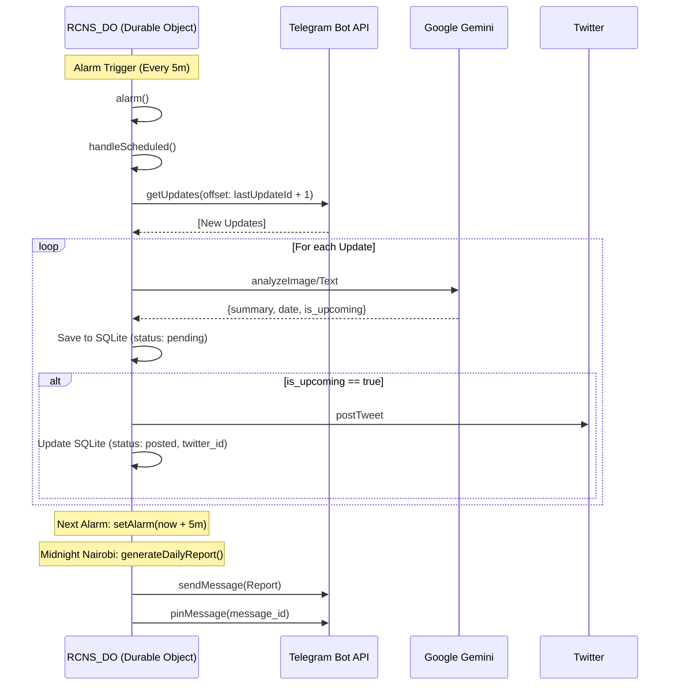

# RCNS Automation Workflow

This document outlines the automated workflow for the Rotary Club Notification System (RCNS), running on Cloudflare Workers.

## 1. Ingestion (Trigger)

* **Source**: Telegram Channel `-1003893041237`.
* **Mechanism**: **Self-Rescheduling Alarm** via `getUpdates`.
* **Action**:
    1. The `RCNS_DO` maintains a persistent internal alarm (every 5 mins).
    2. `RCNS_DO.handleScheduled` wakes up and triggers `checkNewMessages`.
    3. `TelegramCollector` fetches updates newer than `lastUpdateId`.
    4. New messages are passed sequentially to `handleIngest`.

## 2. Analysis (Processing)

* **Service**: `GeminiService` (Google Gemini 2.5 Flash).
* **Input**: Text content and/or Media (Flyer Image) from the Telegram message.
* **Action**:
    1. `RCNS_DO` downloads media if present.
    2. `GeminiService.analyzeImage(buffer)` or `analyzeText(text)` is called.
    3. **Prompt**: Extracts precise event metadata:
        * `summary`: Brief event description.
        * `date`: Event date/time.
        * `location`: Venue.
        * `is_upcoming`: Boolean flag to filter past events.
    4. The JSON result is stored in `FactStore` (SQLite).

## 3. Storage (Persistence)

* **Component**: `FactStore` (Durable Object SQLite).
* **Data**:
  * `posts`: Table containing raw text, analysis, generated tweet copy, and status.
  * `lastUpdateId`: Key in DO storage to track polling position.

## 4. Publishing & Reporting

* **Twitter**: Automatically posts if `is_upcoming` is true and a tweet copy is generated.
* **Daily Reports**: Triggered at 00:00 Nairobi Time (UTC+3) via the same CRON heartbeat.
* **Mechanism**: Reports are sent to the Telegram source channel and pinned.

## Diagram

