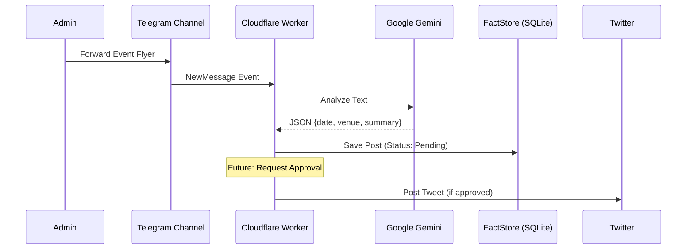

# RCNS Automation Workflow

This document outlines the automated workflow for the Rotary Club Notification System (RCNS), running on Cloudflare Workers.

## 1. Ingestion (Trigger)
*   **Source**: Telegram Channel `-1003893041237`.
*   **Mechanism**: `TelegramCollector` (GramJS) listens for `NewMessage` events.
*   **Action**:
    1.  User/Admin forwards a flyer or text message to the channel.
    2.  Worker receives the event via `TelegramCollector.ts`.
    3.  Message is passed to `RCNS_DO.handleIngest`.

## 2. Analysis (Processing)
*   **Service**: `GeminiService` (Google Gemini Pro).
*   **Input**: Text content from the Telegram message.
*   **Action**:
    1.  `RCNS_DO` extracts text from the message.
    2.  `GeminiService.analyzeText(text)` is called.
    3.  **Prompt**: Analyzes text to extract:
        *   `summary`: Brief event description.
        *   `date`: Event date/time.
        *   `location`: Venue.
        *   `entities`: Key people/orgs.
    4.  The JSON result is stored in `FactStore` (SQLite) alongside the raw message.

## 3. Storage (Persistence)
*   **Component**: `FactStore` (SQLite).
*   **Data**:
    *   `id`: Message ID.
    *   `raw_text`: Original message.
    *   `processed_json`: Gemini analysis result.
    *   `status`: Set to `pending`.

## 4. Publishing (Output)
*   **Target**: Twitter / X.
*   **Mechanism**: `TwitterPublisher` (OAuth 1.0a).
*   **Action**:
    *   Currently, publishing is triggered manually or via code logic (e.g., auto-publish if high confidence).
    *   **Future**: Admin approval button in Telegram to trigger `twitter.postTweet`.

## Diagram

